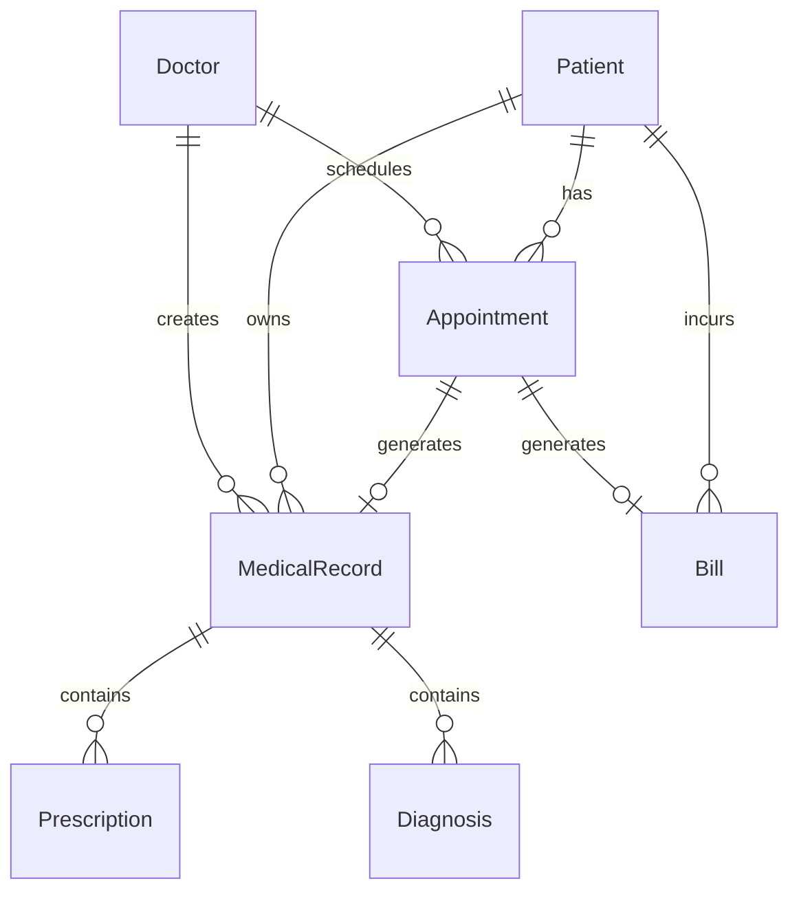

# CareSync Refactoring Tasks
## Concrete Steps for Intentional Simplification

**Created:** October 10, 2025
**Related:** [STRATEGIC_OVERHAUL_PLAN.md](./STRATEGIC_OVERHAUL_PLAN.md)

---

## 🎯 Task Categories

- 🔴 **Critical** - Foundational changes
- 🟡 **Important** - Significant improvements
- 🟢 **Nice-to-Have** - Polish and optimization

---

## Phase 1: Discovery & Documentation (Week 1-2)

### 🔴 Task 1.1: Define User Personas
**File:** Create `docs/PERSONAS_AND_WORKFLOWS.md`

**Personas to Define:**
```markdown
1. Receptionist/Front Desk
   - Goals: Check in patients quickly, manage appointments
   - Pain points: Too many clicks, unclear workflow
   - Key tasks: Patient registration, appointment scheduling

2. Doctor/Healthcare Provider
   - Goals: Document visits efficiently, view patient history
   - Pain points: Complex medical record forms, slow navigation
   - Key tasks: Open medical record, document visit, prescribe

3. Administrator/Practice Manager
   - Goals: Monitor practice health, manage billing
   - Pain points: No overview dashboard, scattered reports
   - Key tasks: View revenue, manage schedules, review reports

4. (Optional) Nurse/Medical Assistant
   - Goals: Prepare patient for doctor, take vitals
   - Pain points: TBD based on actual usage
   - Key tasks: TBD
```

**Deliverable:** Document with user stories for each persona

---

### 🔴 Task 1.2: Map Current vs Desired State
**File:** Create `docs/STATE_COMPARISON.md`

**Template:**
```markdown
## Current State
- Entities: [List all 18+]
- API Endpoints: [Count and categorize]
- UI Pages: [List all pages]
- User Complaints: [Known issues]

## Desired State
- Entities: [8-10 core entities]
- API Endpoints: [Focused 20-25]
- UI Pages: [Workflow-based pages]
- User Benefits: [Expected improvements]

## Gap Analysis
- What to remove
- What to consolidate
- What to refactor
- What to add (if anything)
```

---

### 🟡 Task 1.3: Audit Feature Usage
**Action:** Add analytics/logging to understand actual usage

**Questions to Answer:**
```
1. Which entities are never used?
   - Check: Staff, Insurance, Treatment entities

2. Which API endpoints get zero calls?
   - Review server logs for past 30 days

3. Which UI pages are rarely visited?
   - Add simple page view tracking

4. Which features cause the most errors?
   - Review error logs
```

**Deliverable:** `docs/FEATURE_USAGE_AUDIT.md`

---

### 🟢 Task 1.4: Create Simplified ERD
**Tool:** Draw.io, Mermaid, or any ERD tool

**Entities to Include:**


**Deliverable:** `docs/SIMPLIFIED_ERD.png` or `.mmd`

---

## Phase 2: Domain Refactoring (Week 3-4)

### 🔴 Task 2.1: Merge Domain + Application Layers
**Goal:** Reduce project complexity

**Steps:**
```bash
1. Create new project: CareSync.Core

2. Move from Domain → Core:
   - Entities/
   - ValueObjects/
   - Enums/
   - Interfaces/
   - Services/ (domain services)

3. Move from Application → Core:
   - DTOs/
   - Mapping/
   - Validators/ (simplified)
   - Services/ (application services)

4. Remove:
   - Commands/ (CQRS)
   - Queries/ (CQRS)
   - Common/Results (use simple Result<T>)

5. Update all project references

6. Update namespaces

7. Test compilation
```

**Files Affected:** Entire solution structure

**Estimated Time:** 4-6 hours

---

### 🔴 Task 2.2: Remove Unused Entities
**Goal:** Simplify domain model

**Candidates for Removal:**

#### Option A: Full Removal (if never used)
```csharp
// Remove these files if usage audit shows zero usage:
- Staff.cs (merge into Doctor or separate auth concerns)
- Treatment.cs (embed in MedicalRecord)
- TreatmentRecord.cs (redundant)
- InsuranceProvider.cs (defer to future)
- PatientInsurance.cs (defer to future)
- Lab.cs (simplify to embedded lab orders)
```

#### Option B: Simplification (if minimally used)
```csharp
// Simplify Insurance to just fields on Bill
public class Bill
{
    // Instead of InsuranceClaim entity
    public string? InsuranceProvider { get; set; }
    public string? InsurancePolicyNumber { get; set; }
    public decimal? InsuranceCoverage { get; set; }
}
```

**Steps:**
1. Back up database
2. Create migration to drop tables
3. Remove entity classes
4. Remove related repositories
5. Remove related DTOs
6. Remove related API endpoints
7. Remove related UI pages
8. Test thoroughly

**Estimated Time:** 6-8 hours

---

### 🟡 Task 2.3: Simplify MedicalRecord
**Goal:** Reduce complexity of medical records

**Current Structure:**
```csharp
MedicalRecord (aggregate root)
  → VitalSigns (separate table)
  → Diagnosis (separate table)
  → Prescription (separate table)
  → TreatmentRecord (separate table)
```

**Simplified Structure:**
```csharp
MedicalRecord
{
    // Core fields
    Guid Id
    Guid PatientId
    Guid DoctorId
    Guid? AppointmentId
    DateTime VisitDate

    // Medical content (flatten)
    string ChiefComplaint
    string HistoryOfPresentIllness
    string PhysicalExamination
    string Assessment
    string Plan

    // Vital Signs (embedded JSON or separate simple table)
    VitalSigns Vitals { get; set; } // Single object, not collection

    // Diagnoses (JSON array or comma-separated if simple)
    List<string> Diagnoses { get; set; }

    // Prescriptions (JSON array or separate simple table)
    List<Prescription> Prescriptions { get; set; }

    // Record status
    bool IsFinalized
    DateTime? FinalizedDate
}

// Simplified Prescription
public class Prescription
{
    string Medication
    string Dosage
    string Frequency
    string Instructions
}
```

**Migration Strategy:**
```sql
-- Keep backwards compatibility
-- Add new JSON columns
ALTER TABLE MedicalRecords ADD DiagnosesJson NVARCHAR(MAX)
ALTER TABLE MedicalRecords ADD VitalsJson NVARCHAR(MAX)

-- Migrate data
UPDATE MedicalRecords
SET DiagnosesJson = (SELECT * FROM Diagnoses WHERE MedicalRecordId = Id FOR JSON AUTO)

-- Later: Drop old tables after validation
```

**Estimated Time:** 8-10 hours

---

### 🟡 Task 2.4: Consolidate DTOs
**Goal:** One DTO per entity (not 3-4)

**Current Anti-Pattern:**
```csharp
CreatePatientDto    // Different fields
UpdatePatientDto    // Different fields
UpsertPatientDto    // Combined fields
PatientDto          // Response
```

**Simplified Pattern:**
```csharp
// Single DTO for all operations
public class PatientDto
{
    public Guid? Id { get; set; }        // Null = Create, Value = Update
    public string FirstName { get; set; }
    public string LastName { get; set; }
    // ... all fields
}

// Simple mapper
public static class PatientMapper
{
    public static Patient ToEntity(PatientDto dto) { }
    public static PatientDto ToDto(Patient entity) { }
}
```

**Files to Refactor:**
- `DTOs/Patients/` - Consolidate to single PatientDto
- `DTOs/Doctors/` - Consolidate to single DoctorDto
- `DTOs/Appointments/` - Consolidate to single AppointmentDto
- `DTOs/MedicalRecords/` - Consolidate to single MedicalRecordDto
- `DTOs/Billing/` - Consolidate to single BillDto

**Estimated Time:** 4-6 hours

---

### 🟢 Task 2.5: Remove Domain Events (Optional)
**Goal:** Simplify if not providing value

**Current Usage Audit:**
```csharp
// Check if these are actually handled anywhere
MedicalRecordCreatedEvent
MedicalRecordFinalizedEvent
AppointmentScheduledEvent
// etc.
```

**If no handlers exist:**
1. Remove IHasDomainEvents interface
2. Remove domain event classes
3. Remove event dispatching logic
4. Simplify entities

**If handlers exist:**
- Keep only if they provide real value (e.g., sending notifications)
- Otherwise, inline the logic

**Estimated Time:** 2-4 hours

---

## Phase 3: API Simplification (Week 5)

### 🔴 Task 3.1: Remove CQRS/MediatR
**Goal:** Direct service calls for simplicity

**Current Pattern:**
```csharp
// Controller
public async Task<ActionResult> Create(CreateDto dto)
{
    var result = await _mediator.Send(new CreateCommand(dto));
    return Ok(result);
}

// Handler
public class CreateHandler : IRequestHandler<CreateCommand, Result<Dto>>
{
    public async Task<Result<Dto>> Handle(...)
    {
        // Business logic
    }
}
```

**Simplified Pattern:**
```csharp
// Service
public class PatientService : IPatientService
{
    public async Task<Result<PatientDto>> SaveAsync(PatientDto dto)
    {
        // Validation
        // Business logic
        // Save
        return Result.Success(dto);
    }
}

// Controller
public async Task<ActionResult> Save(PatientDto dto)
{
    var result = await _patientService.SaveAsync(dto);
    return result.IsSuccess ? Ok(result.Value) : BadRequest(result.Error);
}
```

**Steps:**
1. Create simple service interfaces
2. Implement services with business logic
3. Update controllers to use services
4. Remove MediatR registration
5. Remove Command/Query classes
6. Remove Handler classes
7. Test all endpoints

**Files to Create:**
```
src/CareSync.Core/Services/
  ├── IPatientService.cs
  ├── PatientService.cs
  ├── IDoctorService.cs
  ├── DoctorService.cs
  ├── IAppointmentService.cs
  ├── AppointmentService.cs
  ├── IMedicalRecordService.cs
  ├── MedicalRecordService.cs
  └── IBillingService.cs
      BillingService.cs
```

**Estimated Time:** 10-12 hours

---

### 🟡 Task 3.2: Consolidate API Endpoints
**Goal:** Fewer, smarter endpoints

**Before:**
```csharp
[HttpPost] Create(CreateDto dto)
[HttpPut("{id}")] Update(Guid id, UpdateDto dto)
[HttpPost("upsert")] Upsert(UpsertDto dto)
```

**After:**
```csharp
[HttpPost] Save(PatientDto dto)  // Smart save
[HttpGet("{id}")] Get(Guid id)
[HttpGet] GetAll([FromQuery] PaginationParams params)
[HttpDelete("{id}")] Delete(Guid id)
```

**Estimated Time:** 3-4 hours

---

### 🟡 Task 3.3: Simplify Validation
**Goal:** Remove FluentValidation ceremony for simple cases

**Before:**
```csharp
public class CreatePatientDtoValidator : AbstractValidator<CreatePatientDto>
{
    public CreatePatientDtoValidator()
    {
        RuleFor(x => x.FirstName).NotEmpty().MaximumLength(50);
        RuleFor(x => x.Email).EmailAddress();
    }
}
```

**After (for simple validation):**
```csharp
public class PatientDto
{
    [Required, MaxLength(50)]
    public string FirstName { get; set; }

    [EmailAddress]
    public string? Email { get; set; }
}
```

**Keep FluentValidation only for:**
- Complex cross-field validation
- Conditional validation
- Custom business rules

**Estimated Time:** 2-3 hours

---

### 🟢 Task 3.4: Add API Documentation
**Goal:** Clear, narrative API documentation

**Create:** `docs/API_GUIDE.md`

**Template:**
```markdown
## Patient Management

### Create or Update Patient
`POST /api/patients`

**Purpose:** Register a new patient or update existing patient information

**Request Body:**
```json
{
  "id": null,  // or existing ID for update
  "firstName": "Juan",
  "lastName": "Dela Cruz",
  ...
}
```

**Response:**
```json
{
  "id": "guid",
  "firstName": "Juan",
  ...
}
```

**Common Errors:**
- 400: Validation failed
- 404: Patient not found (for updates)
```

**Estimated Time:** 4-6 hours

---

## Phase 4: UI Workflow Redesign (Week 6-8)

### 🔴 Task 4.1: Create Role-Based Dashboards

#### Reception Dashboard
**File:** `Pages/Reception/Dashboard.razor`

**Features:**
- Today's appointments (table with status)
- Quick patient search
- Check-in button (prominent)
- New appointment button
- Payment collection shortcuts

**Wireframe:**
```
┌─────────────────────────────────────────┐
│ Reception Dashboard                      │
├─────────────────────────────────────────┤
│                                          │
│  Today's Appointments                    │
│  ┌────────────────────────────────────┐ │
│  │ 9:00 AM  Juan DC    Dr. Smith  □  │ │
│  │ 9:30 AM  Maria R    Dr. Jones  ✓  │ │
│  │ 10:00 AM Pedro S    Dr. Smith  □  │ │
│  └────────────────────────────────────┘ │
│                                          │
│  [🔍 Find Patient]  [➕ New Appointment] │
│                                          │
└─────────────────────────────────────────┘
```

#### Doctor Dashboard
**File:** `Pages/Doctor/Dashboard.razor`

**Features:**
- My schedule for today
- Patients waiting (highlighted)
- Quick access to start visit
- Pending medical records
- Recent patients

#### Admin Dashboard
**File:** `Pages/Admin/Dashboard.razor`

**Features:**
- Revenue summary (cards)
- Appointment statistics
- Overdue bills
- Doctor schedule overview

**Estimated Time:** 12-16 hours (all dashboards)

---

### 🟡 Task 4.2: Build Check-In Workflow
**File:** `Pages/Reception/CheckIn.razor`

**Flow:**
```
1. Search/Select Patient
   ↓
2. Verify Information (quick edit if needed)
   ↓
3. Select/Confirm Appointment
   ↓
4. Mark as Checked In
   ↓
5. (Optional) Collect Payment
   ↓
6. Done → Back to Dashboard
```

**UI Requirements:**
- Large, clear buttons
- Single-page flow (no navigation)
- Auto-focus on search input
- Keyboard shortcuts
- Success confirmation

**Estimated Time:** 8-10 hours

---

### 🟡 Task 4.3: Build Doctor Visit Workflow
**File:** `Pages/Doctor/Visit.razor`

**Flow:**
```
1. Select Patient from Today's Schedule
   ↓
2. Open/Create Medical Record
   ↓
3. Document Visit (single form)
   - Chief Complaint
   - Vitals (quick entry)
   - Assessment
   - Plan
   - Prescriptions (with templates)
   ↓
4. Save Draft (auto-save)
   ↓
5. Finalize Record
   ↓
6. Next Patient
```

**Features:**
- Template system for common diagnoses
- Drug lookup/autocomplete
- Voice-to-text (future)
- Previous visit summary (sidebar)

**Estimated Time:** 16-20 hours

---

### 🟡 Task 4.4: Simplify Patient Registration
**File:** `Pages/Reception/PatientRegistration.razor`

**Progressive Disclosure:**
```
Step 1: Essential Info
- Name
- Date of Birth
- Gender
- Contact (phone or email)
[Continue →]

Step 2: Address (auto-complete)
- Province → City → Barangay
[Continue →]

Step 3: Additional Info (optional)
- PhilHealth
- Allergies
- Medical History
[Save →]
```

**Estimated Time:** 8-10 hours

---

### 🟢 Task 4.5: Add Keyboard Shortcuts
**Goal:** Power user efficiency

**Common Shortcuts:**
```
Ctrl+K    - Quick search (patient/appointment)
Ctrl+N    - New patient
Ctrl+A    - New appointment
Ctrl+S    - Save current form
Esc       - Cancel/Close modal
Enter     - Confirm/Submit (context-aware)
```

**Implementation:**
- Use `@onkeydown` in Blazor
- Show shortcut hints in UI
- Make configurable

**Estimated Time:** 4-6 hours

---

## Phase 5: Testing & Refinement (Week 9-10)

### 🔴 Task 5.1: Update Unit Tests
**Goal:** Maintain test coverage

**Focus Areas:**
- Service layer tests (replace command handler tests)
- Domain entity tests (ensure business rules)
- Validation tests

**Estimated Time:** 8-12 hours

---

### 🟡 Task 5.2: Add Workflow Integration Tests
**Goal:** Test user flows end-to-end

**Test Scenarios:**
```csharp
[Fact]
public async Task CheckInPatient_CompleteFlow_Success()
{
    // Arrange: Create patient and appointment
    // Act: Check in patient
    // Assert: Appointment status updated, ready for doctor
}

[Fact]
public async Task DoctorVisit_DocumentAndFinalize_Success()
{
    // Arrange: Patient checked in
    // Act: Doctor creates and finalizes medical record
    // Assert: Record saved, appointment completed
}
```

**Estimated Time:** 8-12 hours

---

### 🟡 Task 5.3: User Acceptance Testing
**Goal:** Validate with real users

**Test Plan:**
```markdown
1. Recruit 2-3 users per persona
2. Give realistic scenarios
3. Observe without helping
4. Collect feedback
5. Identify pain points
6. Iterate
```

**Estimated Time:** 1-2 weeks (includes iterations)

---

## Phase 6: Polish & Deploy (Week 11-12)

### 🟢 Task 6.1: Performance Optimization
**Areas:**
- Database query optimization
- API response time
- UI load time
- Bundle size reduction

**Tools:**
- SQL Server Profiler
- Browser DevTools
- Lighthouse

**Estimated Time:** 8-12 hours

---

### 🟢 Task 6.2: Security Audit
**Checklist:**
- [ ] SQL injection prevention (parameterized queries)
- [ ] XSS prevention (proper encoding)
- [ ] CSRF protection
- [ ] Authentication/authorization review
- [ ] Sensitive data encryption
- [ ] API rate limiting
- [ ] Input validation
- [ ] Dependency vulnerabilities

**Estimated Time:** 8-12 hours

---

### 🟡 Task 6.3: Documentation Update
**Documents to Update:**
```
✅ README.md - Updated architecture
✅ API_GUIDE.md - New simplified API
✅ USER_GUIDE.md - Workflow documentation
✅ DEPLOYMENT.md - Updated deployment steps
✅ CHANGELOG.md - Document all changes
```

**Estimated Time:** 6-8 hours

---

### 🔴 Task 6.4: Deployment Preparation
**Checklist:**
```
[ ] Backup production database
[ ] Create rollback plan
[ ] Update connection strings
[ ] Configure environment variables
[ ] Run database migrations
[ ] Deploy to staging
[ ] Smoke test staging
[ ] Deploy to production
[ ] Monitor for issues
[ ] Announce to users
```

**Estimated Time:** 4-8 hours (+ monitoring)

---

## Summary: Total Estimated Time

| Phase | Duration | Priority |
|-------|----------|----------|
| Phase 1: Discovery | 1-2 weeks | 🔴 Critical |
| Phase 2: Domain | 1-2 weeks | 🔴 Critical |
| Phase 3: API | 1 week | 🔴 Critical |
| Phase 4: UI | 2-3 weeks | 🟡 Important |
| Phase 5: Testing | 1-2 weeks | 🟡 Important |
| Phase 6: Deploy | 1-2 weeks | 🟢 Nice-to-Have |
| **Total** | **8-12 weeks** | |

---

## Getting Started

### Today (Day 1)
1. ✅ Read STRATEGIC_OVERHAUL_PLAN.md
2. ✅ Read this document
3. ⬜ Create branch: `git checkout -b feature/strategic-overhaul`
4. ⬜ Start Task 1.1: Define user personas
5. ⬜ Set up task tracking (GitHub Issues/Projects)

### This Week (Week 1)
- Complete Phase 1 discovery
- Document findings
- Get stakeholder buy-in
- Plan detailed timeline

### Next Decision Point (End of Week 2)
**Review progress and decide:**
- Continue with full overhaul?
- Adjust scope based on findings?
- Pause and implement quick wins first?

---

## Notes

### Risk Mitigation
- **Feature branch:** All work in `feature/strategic-overhaul`
- **Incremental commits:** Small, reversible changes
- **Continuous integration:** Tests run on every push
- **Stakeholder reviews:** Weekly demos
- **Rollback plan:** Can revert if needed

### Communication Plan
- **Daily:** Quick standup (15 min)
- **Weekly:** Progress review + demo
- **Bi-weekly:** Stakeholder update
- **Monthly:** Executive summary

---

**Remember:** This is a living document. Update it as you learn. Adjust estimates based on reality. Celebrate progress!
